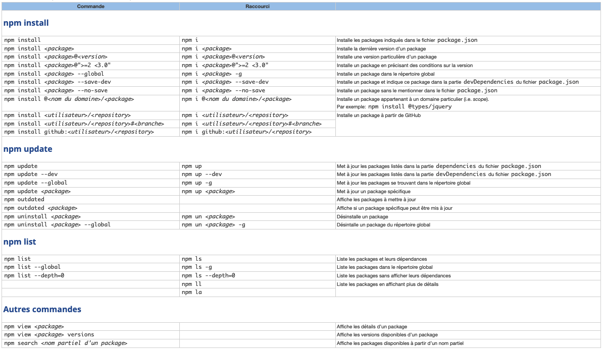
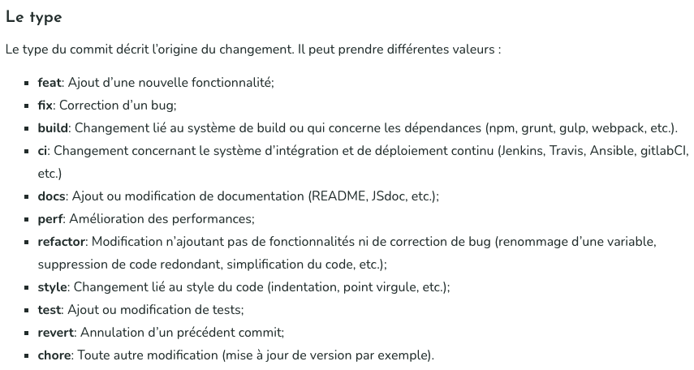

# 1. Prime-app

- [1. Prime-app](#1-prime-app)
  - [1.1. npm](#11-npm)
    - [1.1.1. Initialisation de npm](#111-initialisation-de-npm)
    - [1.1.2. Liste des commandes de base](#112-liste-des-commandes-de-base)
    - [1.1.3. Installation des dépendances de développement](#113-installation-des-dépendances-de-développement)
  - [1.2. Purgecss](#12-purgecss)
  - [1.3. Git et Github](#13-git-et-github)
    - [1.3.1. Initialisation d'un dépôt](#131-initialisation-dun-dépôt)
    - [1.3.2. Commiter les modifications](#132-commiter-les-modifications)
    - [1.3.3. Types de commit](#133-types-de-commit)
    - [1.3.4. Modèle de commit](#134-modèle-de-commit)
    - [1.3.5. Les branches](#135-les-branches)
  - [1.4. Badges markdown et émoji](#14-badges-markdown-et-émoji)

## 1.1. npm

### 1.1.1. Initialisation de npm

```bash
npm init -y
```

### 1.1.2. Liste des commandes de base



Lien vers les options de package.json :  
[https://docs.npmjs.com/cli/v8/configuring-npm/package-json](https://docs.npmjs.com/cli/v8/configuring-npm/package-json)

### 1.1.3. Installation des dépendances de développement

Liste des dépendances :
- Webpack :
  - webpack
  - webpack-cli
- babel-loader :
  - babel-loader
  - @babel/core
  - @babel/preset-env
  - @babel/- plugin-transform-arrow-functions
- Préprocesseur :
  - sass
- Linter :
  - eslint
- testing :
  - jest
  - @testing-library/dom
  - @types/jest
  
@testing-library/jest-dom => a voir pour les customes matchers et user-event

Coller dans package.json :
```json
"devDependencies": {
  "@babel/core": "^7.17.5",
  "@babel/plugin-transform-arrow-functions": "^7.16.7",
  "@babel/preset-env": "^7.16.11",
  "@testing-library/dom": "^8.11.3",
  "@types/jest": "^27.4.1",
  "babel-loader": "^8.2.3",
  "eslint": "^8.10.0",
  "jest": "^27.5.1",
  "sass": "^1.49.9",
  "webpack": "^5.70.0",
  "webpack-cli": "^4.9.2"
}
```

Installer les dépendances :
```bash
npm install
```

Mise à jour des dépendances (optionnelle) :
```bash
npm update
```

Commandes npm à coller dans package.json :
```json
"build": "webpack --config webpack.config.js",
"sass": "sass src/sass/app.scss css/app.css --watch",
"purge": "purgecss --css css/app.css --content dist/index.html dist/app.bundle.js -o dist",
"test": "jest --watch --verbose",
"test-cov": "jest --coverage",
"server-src": "live-server --port=8080 --open=\"src/index.html\"",
"server-dist": "live-server --port=8080 --open=\"dist/index.html\""
```

## 1.2. Purgecss

Installation (en global seulement) :
```bash
npm i -g purgecss
```

Liens vers la documentation :  
[https://purgecss.com](https://purgecss.com)

## 1.3. Git et Github

### 1.3.1. Initialisation d'un dépôt

Après avoir créer un repo Github :

Initialiser son dépôt en local :
```bash
git init
git add -A
git commit -m "init"
git branch -M main
git remote add origin https://github.com/mondepot/projet
git push -u origin main
```

### 1.3.2. Commiter les modifications

Sélection des fichiers à commiter :
```bash
git add <fichier>
```

Sélectionner tous les fichiers modifiés :
```bash
git add -A
```

Commit des fichiers sélectionnés sur la branche courante :
```bash
git commit -m "message de commit"
```

### 1.3.3. Types de commit



### 1.3.4. Modèle de commit

```bash
[FIX] index (#9): change alt text images

Alt text images must be different than images name in "Activity" section.

Closes #9
```

### 1.3.5. Les branches

Voir les branches éxistantes :
```bash
git branch
```

Créer une nouvelle branche :
```bash
git branch <nouvelle branche>
```

Changer de branche :
```bash
git checkout <branche>
```

Push d'une branche local sur une branche distante :
```bash
git push <remote> <branche>
```

Renommer une branche :
```bash
git branch -m <old branch> <new name>
```

Supprimer une branche :
```bash
git branch -d <branche>
```

Supprimer une branche distante :
```bash
git push <remote> --delete <branche>
```

Ramener une branche sur la branche courante en concervant l'historique :
```bash
git merge --no-ff <branch>
```

Liens vers la documentation :  
[https://git-scm.com/docs](https://git-scm.com/docs) 

## 1.4. Badges markdown et émoji

Badges markdown :  
[https://github.com/Ileriayo/markdown-badges](https://github.com/Ileriayo/markdown-badges)  
[https://github.com/alexandresanlim/Badges4-README.md-Profile](https://github.com/alexandresanlim/Badges4-README.md-Profile)  
[https://dev.to/envoy_/150-badges-for-github-pnk](https://dev.to/envoy_/150-badges-for-github-pnk)

Complete list of github markdown emoji markup :  
[https://gist.github.com/rxaviers/7360908](https://gist.github.com/rxaviers/7360908)

***
